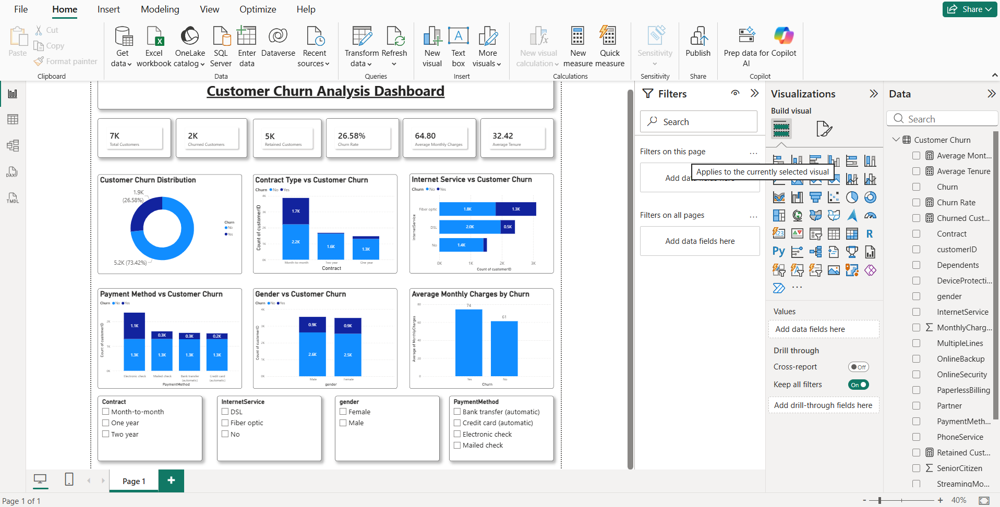

# 📊 Customer Churn Prediction – End-to-End Machine Learning Pipeline

## 📌 Project Overview

This project demonstrates an end-to-end machine learning pipeline for predicting customer churn using the Telco Customer Churn dataset. It includes ETL, Exploratory Data Analysis (EDA), Machine Learning model development, Business Insights, and an interactive Power BI dashboard.

---

## 🎯 Objective

Develop a complete customer churn prediction solution that helps businesses identify customers at risk of leaving and supports data-driven retention strategies.

---

## 🛠️ Technologies Used

- Python
- Pandas
- NumPy
- Matplotlib
- Seaborn
- Scikit-learn
- Joblib
- Jupyter Notebook
- Power BI
- VS Code

---

## ✨ Project Features

- End-to-End Machine Learning Pipeline
- Automated ETL Process
- Exploratory Data Analysis (EDA)
- Random Forest Classification Model
- Interactive Power BI Dashboard
- Business Insights & Recommendations
- Professional Project Documentation

---

## 📂 Project Structure

```text
Week5_End_to_End_Pipeline/
│
├── Dashboard/
├── Dataset/
├── ETL/
├── Images/
├── Model/
├── Notebook/
├── Report/
└── README.md
```

---

## 🤖 Machine Learning Model

| Feature | Details |
|---------|---------|
| Algorithm | Random Forest Classifier |
| Problem Type | Binary Classification |
| Accuracy | **78.32%** |
| Target Variable | Churn |

---

## 📊 Power BI Dashboard

The interactive dashboard includes:

- 📌 KPI Cards
- 📌 Customer Churn Distribution
- 📌 Contract Type vs Customer Churn
- 📌 Internet Service vs Customer Churn
- 📌 Payment Method vs Customer Churn
- 📌 Gender vs Customer Churn
- 📌 Average Monthly Charges by Churn
- 📌 Interactive Slicers

> **Dashboard Link:** *(Will be added after publishing to Power BI Service.)*

---

## 💡 Key Business Insights

- Customers with month-to-month contracts had the highest churn.
- Customers with higher monthly charges were more likely to churn.
- Fiber optic customers showed higher churn than DSL customers.
- Electronic check users experienced comparatively higher churn.
- Customers with longer tenure were more likely to remain with the company.

---

## 📷 Project Screenshots

### Dashboard

> Add the dashboard screenshot after uploading it to GitHub using:

```markdown

```

---

## 📁 Repository Contents

- 📂 Dataset
- 📂 Notebook
- 📂 ETL Pipeline
- 📂 Machine Learning Model
- 📂 Power BI Dashboard
- 📂 Business Insights Report
- 📂 Images

---

## 🚀 Future Improvements

- Hyperparameter tuning
- Model deployment using Flask or Streamlit
- Real-time churn prediction API
- Automated model retraining

---

## 👨‍💻 Author

**Abhay Joshi**

ReadyNest Internship – Week 5
